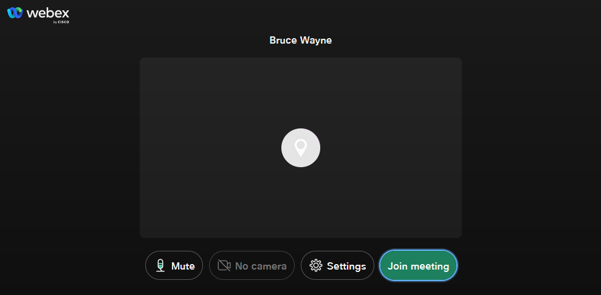
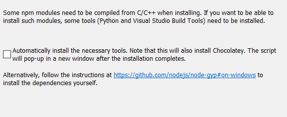

# Webex x ich.app POC

Diesesd Repository dient als Proof of Concept für eine Integration zwischen einer Authentifizierungssoftware und der Webex Umgebung. Ziel des Projektes ist es, Unternehmen mehr Kontrolle und Sicherheit zu gewährleisten, in dem man vor allem unternehmensexterne Meeting-Teilnehmer über eine sichere dritte Stelle authentifiziert, bevor diese einem Webex Meeting beitreten. Dadurch kann ein impersination Access weitestgehend verhindert werden. Auch die Meetings an sich werden sicherer, weil Meeting Informationen nicht direkt mit den Teilnehmern geteilt werden. Sollten diese dennoch freigegeben werden, sind nicht-authentifizierte Benutzer trotzdem nicht in der Lage diesem beizutreten.

Um die Umsetzung eines Produktivsystems zu erleichtern, wurde dieses Script als Demo entwickelt, um die nötigen Requests und Responses zur Webex API zu demonstrieren. Voraussetzung ist eine Webex Site. Über das Script kann ein Gastuser und der Einwahllink erzeugt werden. Der Beitritt zum Meeting erfolgt obligatorisch über ein Browser Widget. Ein Beitritt über die installierte Webex App ist per Design für Gastuser nicht möglich. Das Browser Widget soll exemplarisch zeigen, dass ein Meeting in eine Unternehmensseite oder eine App eingebettet werden kann.

## Dokumentation

Folgend werden die technischen Aspekte der Integration im Einzelnen beschrieben, erklärt und begründet. Das System besteht aus mehreren, voneinander unabhängigen Bauteilen:

1. Meeting Creation
2. Invite Creation
3. Authentication Landing Page
4. Authorization Server
5. Webex Meetings React Widget

Das Projekt wird immer aus der Sicht zweier Rollen beschrieben, dem Meetinersteller und des Meetingteilnehmers.

### Meeting Creation

Als erster Schritt muss ein Meeting erzeugt werden. Es besteht die Möglichkeit, Meetings auch über die von Webex bereitgestellten Tools (Outlook Scheduler, Webex-Site etc.) zu erstellen. Damit aber die höchste Sicherheit erreicht werden kann, werden die Meetings über die Webex API erstellt. Dazu wird eine eigene Web-App benötigt, die ein Erstellungsformular bereitstellt.

##### API Kommunikation

Um mit der API zu kommunizieren, benötigt der erstellende Benutzer einen lizenzierten Webex-Account. Die REST API verwendet als Autorisierung OAuth 2.0.


Das obige Sequenzdiagramm zeigt den Datenfluss zwischen User, App und der Webex Site. Als ersten Schritt, nachdem ein Meeting-Ersteller die URL der App navigiert, ist ein neuer Access Token zu erzeugen. Dazu sollte die App auf die Authentication-Page unserer Webex Integration zeigen. Diese wird erzeugt, nachdem eine Integration auf developer.webex.com erstellt wird. Die Integration muss einmalig vom App Ersteller erzeugt werden, diese ist dann allgemein gültig für alle Webex-Organisationen. Nachdem der User sich erfolgreich mit seinen Webex-Credentials angemeldet hat, wird ein Authorization Code erzeugt und per redirect an einen von uns erstellten Endpoint gesendet. Der Code wird dann per POST Request gegen einen OAuth Bearer Token getauscht. Der Token ist standardmäßig 14 Tage lang gültig, kann aber mittels Refresh Token immer wieder refreshed werden. Mit diesem Token können nun per API Meetings erzeugt werden.

##### Das Meeting

Meetings werden über den Meetings Enpoint erzeugt, die Dokumentation dieses Endpoints findet man [hier](https://developer.webex.com/docs/api/v1/meetings/create-a-meeting). Es werden folgende Parameter verwendet:

```

{
"enabledAutoRecordMeeting": False,
"allowAnyUserToBeCoHost": False,
"enabledJoinBeforeHost": True,
"enableConnectAudioBeforeHost": False,
"excludePassword": True,
"publicMeeting": False,
"enabledWebcastView": False,
"enableAutomaticLock": False,
"allowFirstUserToBeCoHost": False,
"allowAuthenticatedDevices": False,
"sendEmail": False,
"title": <title>,
"start": <start>,
"end": <end>,
"timezone": "Europe/Vienna"
}

```

`excludePassword` und `publicMeeting` stellen sicher, dass keine unerwünschten Teilnehmer an das Meeting teilnehmen können. Das Password darf nicht weitergegeben werden. Da man damit die Meetings auch ohne sich vorher zu registrieren, erstellen könnte. Im Erfolgsfall erhält man eine JSON-Antwort retour mit dem Meeting Details. Wichtig für das Projekt ist die 11-stellige Meetingnummer unter `"meetingNumber": "xxxxxxxxxxx"`. Die erzeugten Meetings sind nun so gesperrt, dass Sie keine Teilnehmer außer dem Erzeuger selbst den Beitritt erlauben. Die Meetings gemeinsam mit den Access Token, der Sie erzeugt hat, müssen serverseitig gesichert werden.

### Invite Creation

Da man keinen Einfluss auf die eigenen Invitations von Webex nehmen kann, müssen eigene Invitations erstellt werden. Dazu wird nach dem Erstellen des Meetings zu einem neuen Formular weitergeleitet. Der erstellende User wird hier gebeten, die E-Mail seiner Teilnehmer bekannt zu geben. Aus diesen E-Mails wird dann die interne Teilnehmerliste erzeugt. Die Teilnehmer erhalten dann die Meetingeinladung per E-Mail als .ics Datei.


### Authentication Landing Page

Sobald ein eingeladener User auf die Meetingeinladung klickt, wird dieser auf einer Landing-Page weitergeleitet, um sich per ich.app anzumelden. Sollte der User auf der internen Gästeliste zu finden sein, so kann für dieser einen JSON Web Token erstellt werden, der mit dem von der Webex API bereitgestellten Key, signiert wird. Dieser Token allein berechtigt jemanden die Webex Produkte zu verwenden. Da wir die einzige Authority sind, die solche Tokens ausstellen kann, haben wir volle Kontrolle darüber, wer unserem Meeting beitritt.

### Authorization Landing Page

Sollte sich der User erfolgreich angemeldet haben, wird erst hier der Token erzeugt. Der Token benötigt folgende Parameter:
-`sub` - interner identifier für den user- muss generiert werden
-`name` - Anzeigenamen für den User
-`iss` - Identifikation des Guest Issuers, wird von Webex bereitgestellt
-`exp` - Ablaufzeit in UNIX-Time

Dieser JWT muss dann in einen OAuth2 Token umgewandelt werden (ist noch eine Limitierung von Webex). Mit diesem Token kann man nun Meetings beitreten.

### Webex React Widget

Falls die Registrierung erfolgreich gewesen ist, wird der User nun zum letzten Teil der App weitergeleitet, nämlich zum Meeting. Das Meeting ist ein React Widget das vollständig konfigurierbar und anpassbar ist. Dokumentation [hier](https://developer.webex.com/docs/widgets), eine weitere Demo, [hier](https://github.com/WebexSamples/webex-meeting-widget-starter).


## Inbetriebnahme

### Step-by-Step installation

Step-by-Step Anleitung für die Inbetriebnahme des Projekts

##### Step 1 Admin Rechte

Die Webapp kann auf allen gängigen Betriebssystemen ausgeführt werden. Für die Installation werden lokale Admin Rechte benötigt.

##### Step 2 Node.js installieren

Die Webapp basiert auf React, somit wird node.js benötigt. Die App läuft in der jetzigen Form nur mit der LTS Version (16.14.2 LTS). Download link: <https://nodejs.org/en/download/>

##### Step 3 Python installieren

Das Projekt und bestimmte Module benötigen Python3. Unter Windows muss dafür während der Installation folgende Option gesetzt werden, damit Python3 gleich mitinstalliert wird.


Ansonsten, kann Python auch über der offiziellen Website heruntergeladen und installiert werden:
<https://www.python.org/downloads>. Sollte Python unter Windows in dieser Weise installiert werden, muss die executable zum "PATH" als System variable hinzugefügt werden.

##### Step 3.5 PC Neustart

Nach der Installation muss der Rechner neu gestartet werden.

##### Step 4 Diese Repository Clonen

Sollte Git vorhanden sein, kann diese Repository einfach über:

`git clone https://github.com/alexghiriti/guest-issuer-demo.git`

Ansonsten unter Code auf ZIP herunterladen klicken und am Rechner in ein Verzeichnis entpacken.

##### Step 5 Dependenicies Installieren

Ein neues Admin-Terminal Fenster öffnen, in den Projektordner navigieren und folgende Kommandos ausführen:

Webex Widget packages installieren mit:
``npx install-peerdeps @webex/widgets``
Python dependencies installieren mit:
``pip install -r .\requirements.txt``
npm dependencies installieren mit:
``npm install``
Bei SSL issues:
``npm config set strict-ssl false``
Bei SSL-Issues mit Python
`pip install --trusted-host pypi.org --trusted-host files.pythonhosted.org -r .\requirements.txt`

##### Step 6 Programm Starten

Sobald alles installiert ist, kann das Pythonskript über folgenden Kommando (dasselbe Terminal benutzen) ausgeführt werden:
``py main.py`
`

### Bedienung des Python Skripts

Das Skript verfügt über einen CMD und versteht 10 Kommandos:

1. create meeting (title, start, end) -> `create <title>, <start>, <end>`
2. add participant (name, mail, meeting_id) -> `add <name>, <mail>, <meeting_id>`
3. goto meeting (meeting_id) -> ``goto <meeting_id>``
4. exit the programm -> ``exit``
5. help -> ``display this help``
6. issue guest ticket -> ``jwt <sub> <name>``
7. exchange guest ticket for for access token -> ``exchange <jwt>``
8. create widget -> ``widget <meeting> <token>``
9. authorize webex integration -> ``login``
10. create oauth access token -> ``auth <code>``

Um das Widget zu starten und einen User zu autorisieren werden folgende Kommandos in dieser Reihenfolge, benötigt. Als alternative kann der Befehl `start` ausgeführt werden, um durch das Skript begleitet zu werden.

1. `login` - Öffnet ein Webex Login Fenster. Hier kann man die Webex Integration autorisieren, damit man einen Zugang zu der Webex API bekommt. Falls das erfolgreich gewesen ist, wird auf der Seite eine Code angezeigt.
2. `auth <code>` - Dieser Code (Lifetime 30 min) kann für einen OAuth2 Bearer Access Token getauscht werden. Im Erfolgsfall wird dieser Token automatisch in `credentials.json` gespeichert.
3. (optional) `create <title> <start> <end>` - Es kann nun einem Meeting erstellt werden. `<title>` ist der Namen  des Meetings (Namen die aus mehreren Wörtern bestehen werden mit "_" notiert z.B.: Mein_Meeting = Mein Meeting). `<start> / <end>` bezeichnen das Start- und Enddatum des Meetings in ISO-Format yyyy-mm-ddTHH:MM:SS (2022-03-15T12:30:00)
4. ``jwt <sub> <name>`` - Damit kann einen Guest Token erstellt werden. `<sub>` ist ein eindeutiger identifier und kann benutzt werden, um User intern zu identifizieren. `<name>` ist der Anzeigenamen des Users. Spaces werden mit "_" dargestellt (z.B.: John_Doe=John Doe)
5. ``exchange <jwt>`` - Damit ein User einem Meeting beitreten kann, muss dieser jwt gegen einen Bearer Access Token getauscht werden. Im Erfolgsfall wird hier einen Token zurückgegeben.
6. `Exchange <jwt>` - Der Guest Token muss in ein API Access Token umgewandelt werden, damit User Meetings beitreten können.
7. `widget <meeting> <token>` - Damit kann das React Widget gestartet werden. `<meeting>` kann entwerder die im Schritt 3 erzeugte Meetingnummer oder eine E-Mail von einem Webex User verwendet werden. `<token>` steht für den in vor hinein erzeugten Token.
8. Das Pythonskript kann nun geschlossen werden (Strg+C). Im selben Terminal jetzt `npm start` ausführen. Das Widget wird in ein Browserfenster starten.
